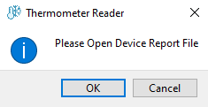
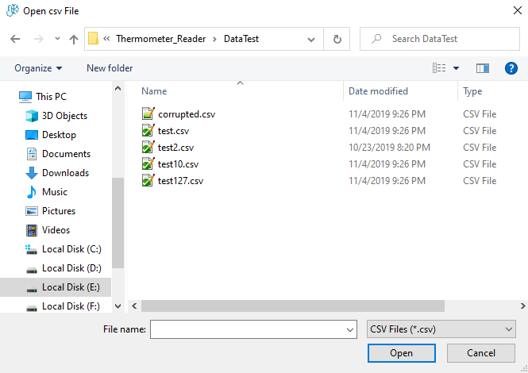
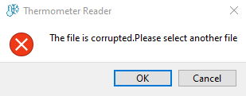
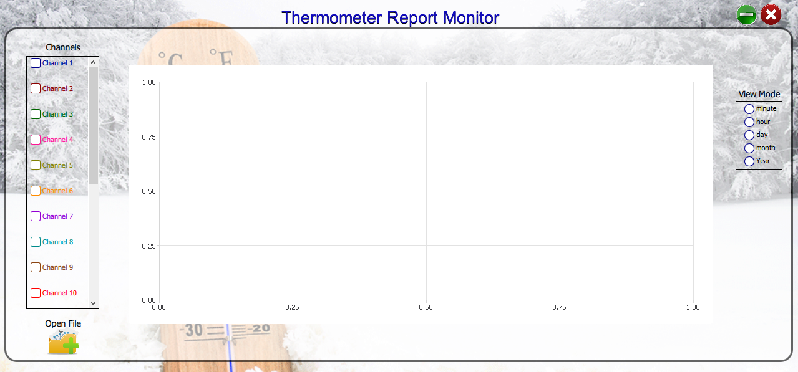
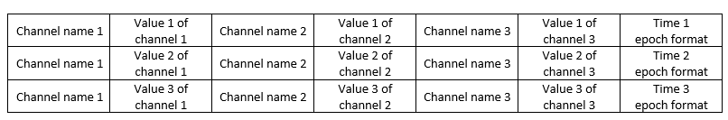

# Data_Logger

## Thermometer Reader

### Prerequisites:

- MSVC2015 or MSVC2017
- Microsoft Visual C++ Compiler
- Qt Creator
- Appropriate Data Format (describe below)

### Usage Steps :

At first you run the project and asked you to select Device Report File :

if "cancel" selected, the project exited, if "ok" selected, you should choose your .CSV fle :

if inappropriate file choosed :

then you have to select another file or exit from project 

if appropriate file choosed :

#### appropriate file :

 
it can be extended by number of sampling and number of channels
some example files are created in folder "DataTest"
